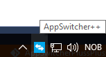

# App Switcher ++ (in Alpha)

App Switcher ++ is a tool for super users that use many applications and windows, and need to work fast.

App Switcher++ is something similar like to Task Switcher [Alt + Tab](https://en.wikipedia.org/wiki/Alt-Tab) in Windows and look much like Task Switcher in Windows 10. 
But it gives you the opportunity to add hotkeys to group windows and switch between them. 

If you, for instance want hotkey (Alt + C) to  switch between Chrome windows,  AppSwitcher++ make that easy.

The program was originally intended to use with [X-Keys XK-80](http://xkeys.com/xkeys/xk80.php) keyboard. But at the request of several I have made support to set up hotkeys without having an [X-Keys](http://xkeys.com) keyboard.

###Configuration\Add hotkeys

1) Left Click on the icon.

2) Right Click "Config"

###Milestone Beta v.1

Planned exit criteria (before we can publish the beta) is 15.3.2017

Enter criteria:
- [ ] `All issue` is defined in the [Milestone Sprint 1](https://github.com/ErikV88/AppSwitcherPlussPluss/milestone/1).

Exit criteria:
- [ ] `All issue` in [Milestone Sprint 1](https://github.com/ErikV88/AppSwitcherPlussPluss/milestone/1) is fixed or closed.

###Developers
***Erik Skagen Vindenes***

Started to develop when he was 12 years, and has worked six years as a developer

He is also certified ISTQB [License 16-CTFL-01594-NOR](http://image-store.slidesharecdn.com/40812e7e-332f-4eb5-a919-ceb595ef1c21-large.jpeg) (Software Testing)
